# Cyber security Base - Project I

Cyber Security Base 2025 course project 1

A demonstration of a web application with five security flaws from the OWASP 2021 top-10 list:

- A01:2021 Broken Access Control
- A03:2021 Injection
- A05:2021 Security Misconfiguration
- A07:2021 Identification and Authentication Failures
- A09:2021 Security Logging and Monitoring Failures


## Installation instructions

Clone the repository
```bash
git clone https://github.com/ttanninen/CSB2025_project1.git
cd CSB2025_project1/flawed_site
```

Set up virtual environment and build dependencies
```bash
python -m venv venv
source venv/bin/activate
pip install django
python manage.py migrate
```

Run server
```bash
python manage.py runserver
```

Use your web browser and browse to
[http://127.0.0.1:8000/](http://127.0.0.1:8000/)


## Introduction
For the demonstration of a flawed web application, I built a very rudimentary quiz portal where students can answer small quizzes made by course teachers. The quizzes can be either browsed from the list or searched by the course search form. The database is populated with sample course and quiz data through migrations, but tester has to register new user(s) and make a couple of quiz submissions to test the security flaws.

## The application contains following five flaws from the OWASP 2021 top-10 list:

### FLAW 1: 
A07:2021 Identification and Authentication Failures

[A07:2021 flaw in code](https://github.com/ttanninen/CSB2025_project1/blob/d4f2cea470eb76d85e91ebcda16ae0c27861cba6/flawed_site/assignment_portal/views.py#L22)

This flaw is present in the new user registration logic in the views.py. When registering a new user, the application does not perform any type of password validation. Therefore, users can register an account with ridiculously insecure passwords.

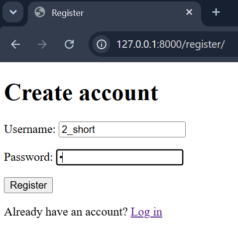

An easy fix is to use Django’s built-in password validators, which can be set up in settings.py and imported to the views.py from django.contrib.auth.password_validation. The selectable validators utilize common password validation methods, such as minimum password length and common password rejection.

To display the possible error messages when insecure passwords get caught in the validators, ValidationError from django.core.exceptions can also be imported and implemented in the application logic as shown in the fix in views.py and in templates/register.html.

[A07:2021 fix in code](https://github.com/ttanninen/CSB2025_project1/blob/d4f2cea470eb76d85e91ebcda16ae0c27861cba6/flawed_site/assignment_portal/views.py#L29)

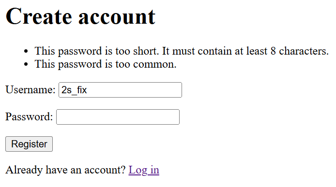
 
### FLAW 2:
A01:2021 Broken Access Control

[A01:2021 flaw in code](https://github.com/ttanninen/CSB2025_project1/blob/d4f2cea470eb76d85e91ebcda16ae0c27861cba6/flawed_site/assignment_portal/views.py#L134)

This flaw is a result of inadequate authorization control in the application. Even though most of the application content requires user to be logged in, there is no system which verifies what content the user has permissions to access. 

The flaw can be demonstrated through the “results” page of the application. Users can see their own quiz submission results by clicking the link on the course after taking the quiz. However, by changing the “result_id” in the address bar, the user can access the quiz results of other students.

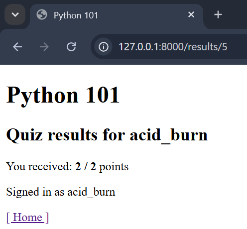
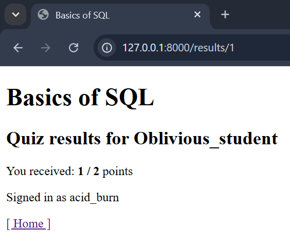

The fix for this flaw is to verify that the user browsing the submission result matches to the user who originally made the submission. This is done simply by comparing the user currently logged in to the recorded submission user with the Django shortcut function “get_object_or_404”. If a Submission object user does not match the user who is currently logged in (retrieved by request.user), no Submission object is retrieved, and the server should return a 404 error.

[A01:2021 fix in code](https://github.com/ttanninen/CSB2025_project1/blob/d4f2cea470eb76d85e91ebcda16ae0c27861cba6/flawed_site/assignment_portal/views.py#L140)


 
### FLAW 3:
A05:2021 Security Misconfiguration

[A05:2021 flaw in code](https://github.com/ttanninen/CSB2025_project1/blob/d4f2cea470eb76d85e91ebcda16ae0c27861cba6/flawed_site/flawed_site/settings.py#L28)

Flaw number three is rather straightforward and it is visible if the fix for the earlier flaw is being tested: Instead of a standard 404 error page, the server returns a debug error page to the user. 

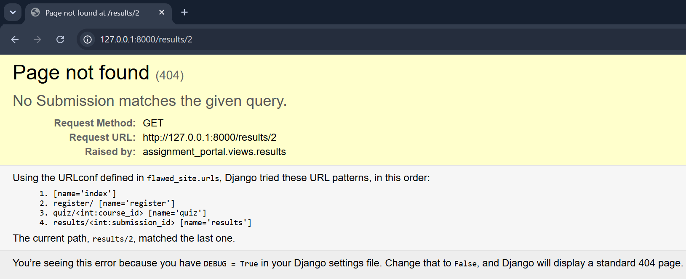

The danger with debug error messages is that in situations where an error occurs, the messages can reveal sensitive data to users, such as source-code details and paths.

The fix is to simply modify settings.py and set variable DEBUG = False, which disables the debugging features.

[A05:2021 fix in code](https://github.com/ttanninen/CSB2025_project1/blob/d4f2cea470eb76d85e91ebcda16ae0c27861cba6/flawed_site/flawed_site/settings.py#L32)

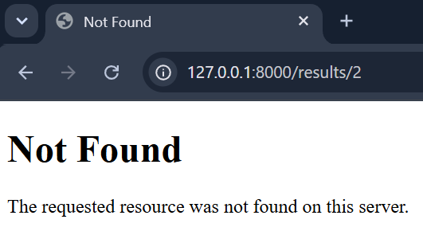
 
### FLAW 4:
A03:2021 Injection

[A03:2021 flaw in code](https://github.com/ttanninen/CSB2025_project1/blob/d4f2cea470eb76d85e91ebcda16ae0c27861cba6/flawed_site/assignment_portal/views.py#L59)

This is a flaw which allows users to manipulate SQL queries in such a way, that users can fetch and possibly manipulate database contents, to which they should not normally have access. The query for course search function can be manipulated by user input to retrieve hidden entries: For example, using search query “’ OR 1=1 -- “ displays all courses in the course database, even the ones, which should be hidden by a tag “is_public = False”.

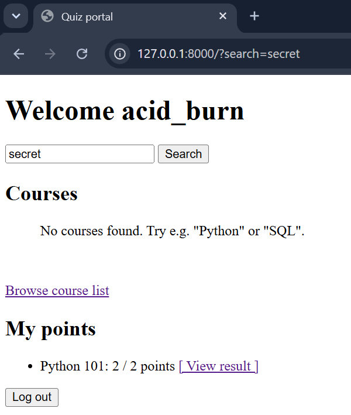
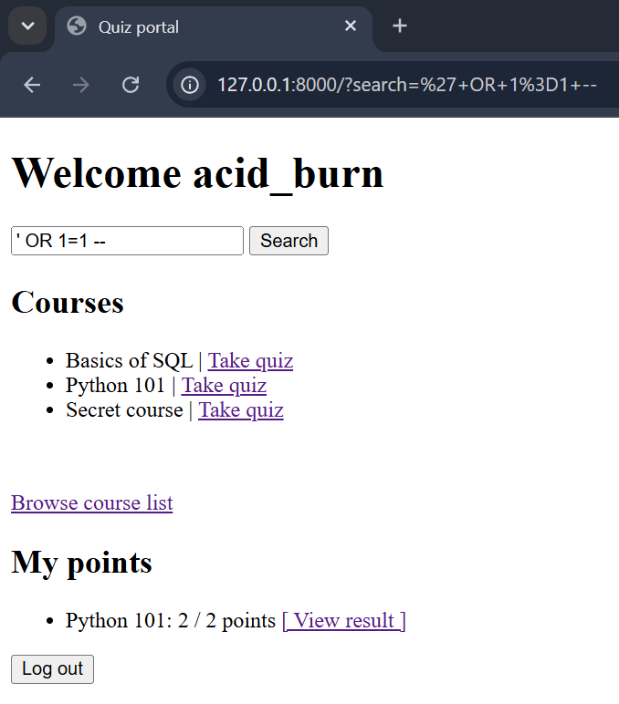

The working logic of the SQL injection flaw is this: The original query for the search function is:

```
SELECT id, name FROM assignment_portal_course 
WHERE is_public = 1 AND name LIKE '%" + search + "%'
```

By replacing the “search”- variable with string “‘ OR 1=1 -- “ the query is effectively modified to form:

```
SELECT id, name FROM assignment_portal_course 
WHERE is_public = 1 AND name LIKE '%’
OR 1=1
```

Where the WHERE statement is first closed by adding ‘ to the end. Then an always-true OR statement is introduced which effectively makes the query say “if 1 = 1, return all id and name entries from the course table” disregarding the is_public = 1 clause. The final “--" from the user input comments out the possible tail of the original query.

The fix is not to use hard-coded SQL queries, but instead use Django’s built in ORM functions. In this case, the safe search query can be achieved by filtering all Course objects by name__icontains (case insensitive name) and is_public = True (meant to be searchable). In this case, the fix is quite a lot easier to implement than to build connections and queries to directly interact with the database.

[A03:2021 fix in code](https://github.com/ttanninen/CSB2025_project1/blob/d4f2cea470eb76d85e91ebcda16ae0c27861cba6/flawed_site/assignment_portal/views.py#L69)

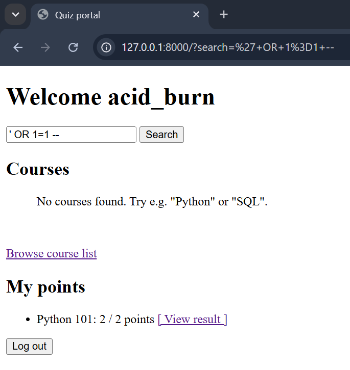

### FLAW 5:
A09:2021 Security Logging and Monitoring Failures

[A09:2021 flaw in code](https://github.com/ttanninen/CSB2025_project1/blob/a9399f3520af09571faba56a822f84d63a3032f7/flawed_site/flawed_site/settings.py#L36)

As such, the application does not have any type of logging in place to monitor and detect potentially suspicious activity. Logging would be an important security feature especially if a security breach or other unauthorized activity should be investigated afterwards.

The fix is obviously to implement logging features to the application backend. This can be achieved by setting up loggers in settings.py and importing Python logging library in the modules where the loggers will be placed. Natural functions where the loggers could be placed would be user inputs, whenever user logins fail, suspicious user registrations, or when someone unauthorized tries to access restricted parts of the application.

In this demonstration the only logged feature is an event when a new user is registered. The log is stored in the application root folder in file “security.log”. Needless to say, in a real-world application the logging would be done more extensively.
First set up the logging in settings.py:

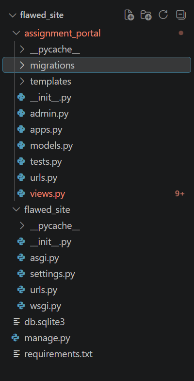

[A09:2021 fix 1 in code](https://github.com/ttanninen/CSB2025_project1/blob/a9399f3520af09571faba56a822f84d63a3032f7/flawed_site/flawed_site/settings.py#L38)

Then implement logging features where desired:

[A09:2021 fix 2 in code](https://github.com/ttanninen/CSB2025_project1/blob/a9399f3520af09571faba56a822f84d63a3032f7/flawed_site/assignment_portal/views.py#L43)

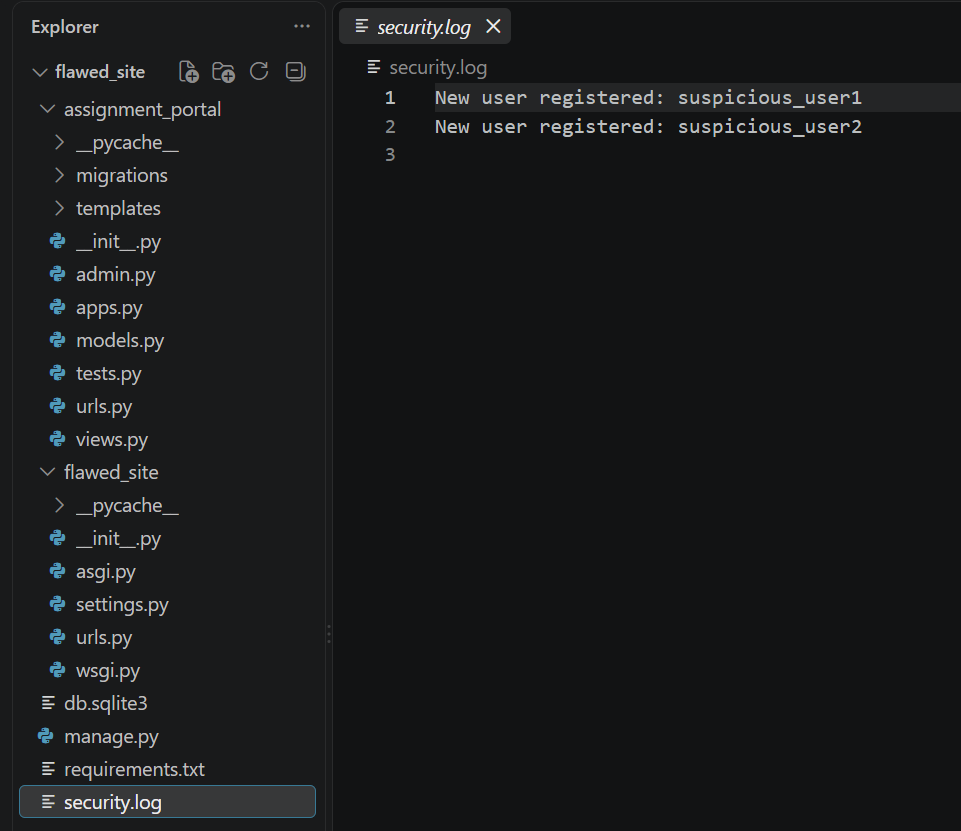
